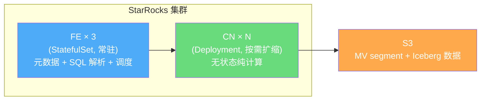
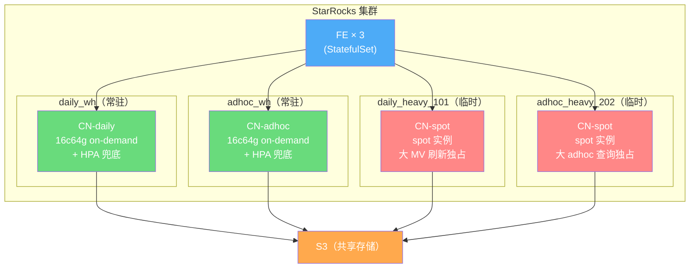
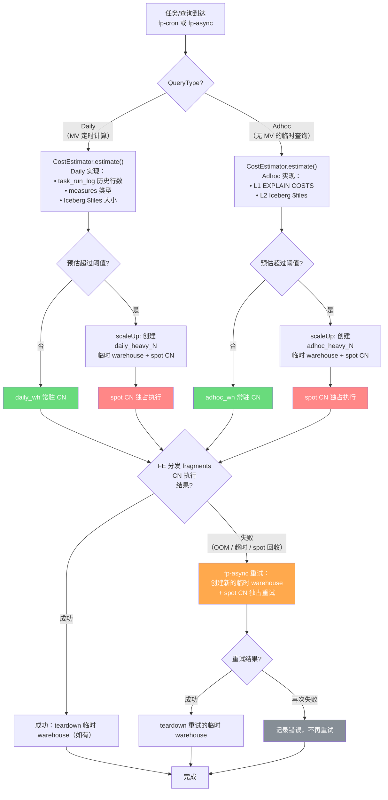
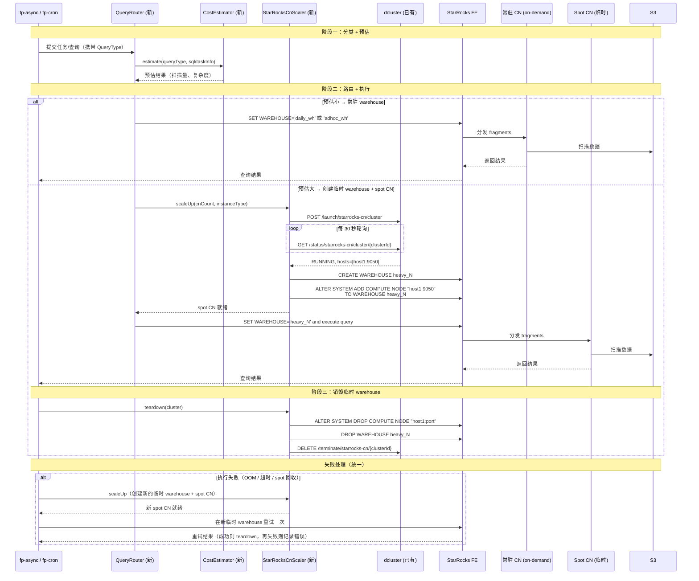
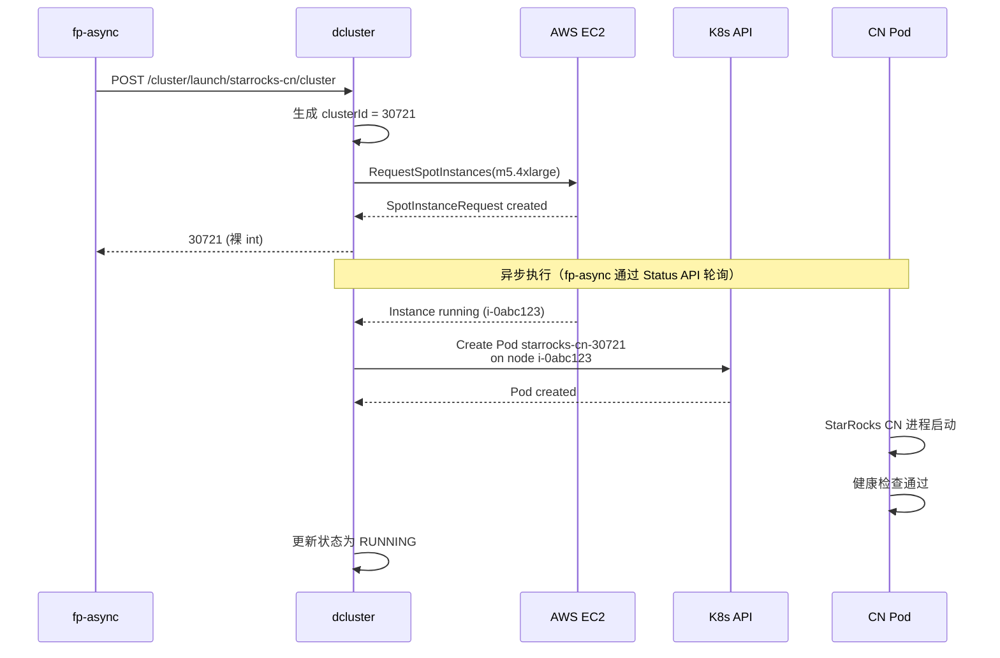
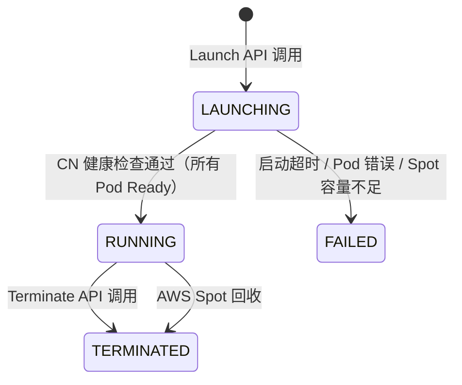
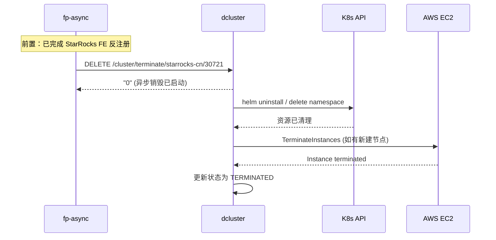
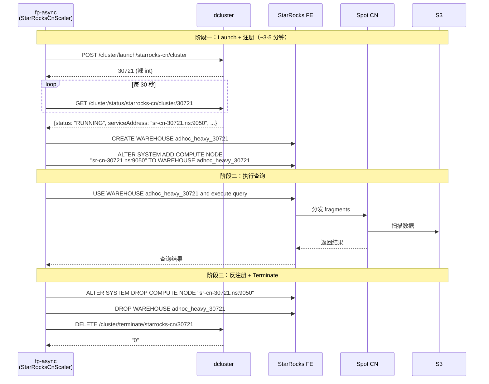
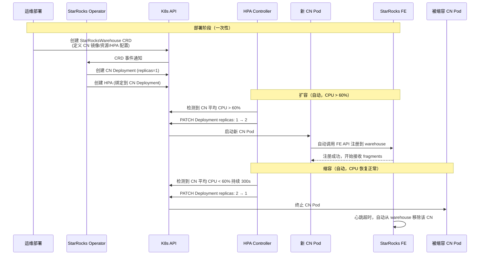

# CRE-6630 StarRocks CN 弹性伸缩 — 系统设计文档

> **日期**: 2026-04-07
> **状态**: Draft
> **相关文档**: [CRE-6630-system-design.md](CRE-6630-system-design.md), [CRE-6630-query-routing-scaling-design.md](CRE-6630-query-routing-scaling-design.md), [CRE-6630-cn-scaling-approaches.md](CRE-6630-cn-scaling-approaches.md)（方案调研）

---

## 目录

1. [背景](#1-背景)
2. [需要解决的问题](#2-需要解决的问题)
3. [整体架构](#3-整体架构)
4. [任务路由与执行](#4-任务路由与执行)
5. [dcluster StarRocks CN API](#5-dcluster-starrocks-cn-api)
6. [HPA 兜底机制](#6-hpa-兜底机制)
7. [Spot 回收与失败处理](#7-spot-回收与失败处理)
8. [资源预估与改进路径](#8-资源预估与改进路径)
9. [监控与可观测性](#9-监控与可观测性)
10. [分阶段实施](#10-分阶段实施)
11. [涉及的关键文件](#11-涉及的关键文件)

---

## 1. 背景

### 1.1 StarRocks Shared-Data 架构

CRE-6630 Feature Stats 系统使用 StarRocks Shared-Data（存算分离）模式：



| 组件 | 部署方式 | 说明 |
|------|---------|------|
| FE | 3 pods StatefulSet，常驻 | 元数据管理、SQL 解析、查询调度 |
| CN | Deployment，按需扩缩 | 纯计算，无状态，数据全在 S3 |
| S3 | 对象存储 | MV segment 文件 + Iceberg 事件数据 |

**CN 是完全无状态的**：不存储数据，只做计算。扩缩容秒级生效，不涉及数据搬迁。

> **版本要求：StarRocks 4.0+**。本设计依赖 multi-warehouse 功能（`CREATE WAREHOUSE` / `DROP WAREHOUSE`），该功能在 3.x 中仅企业版（CelerData）支持，4.0 起已开源（[参考](https://www.starrocks.io/blog/starrocks-4.0-now-available)）。K8s 部署使用 [StarRocks Operator](https://github.com/StarRocks/starrocks-kubernetes-operator) 的 `StarRocksWarehouse` CRD 管理 warehouse 和 CN。

### 1.2 两类计算任务

StarRocks 上跑两类任务，按是否有预建 MV 来区分：

| 维度 | Daily（MV 定时计算） | Ad-hoc（无 MV 的临时查询） |
|------|---------------------|--------------------------|
| 定义 | 已创建 MV 的定时刷新和聚合计算 | 没有预建 MV 的任意 SQL 查询 |
| 触发方式 | fp-cron 定时触发 | 用户随时发起 |
| 可预测性 | 高 — 每天数据量稳定，measure 类型固定 | 低 — 不知道什么时候来、查什么、多大 |
| 典型场景 | MV 增量刷新、Window Merge、孤儿 MV 清理 | 事件分析、实体调查、数据导出、任意 SQL |
| 延迟敏感 | 低 — 批处理，分钟级可接受 | 高 — 用户在等结果 |
| 资源特征 | 写密集（刷新 MV → 写 S3） | 读密集（扫描 S3 Iceberg 数据 → 返回结果） |

### 1.3 原方案及其问题

原方案（来自 CRE-6630-query-routing-scaling-design.md）：每个 >1GB 的查询独立拉起 spot CN → 执行 → 销毁。

**问题**：来了 20 个 2GB 的查询，每个都独立开 CN → 拉起 20 个节点。实际上 4-5 个 CN 共享就够了。节点数量随查询数线性增长，成本和 AWS API 调用都不可控。

---

## 2. 需要解决的问题

### 2.1 AWS Spot 回收风险

**什么是 Spot 实例**：AWS 将闲置资源以 60-90% 折扣出售（Spot），但 AWS 需要时可 2 分钟通知后强制收回。On-Demand 实例不会被收回但价格高。

**StarRocks 在 CN 故障时的行为**（已确认，[Issue #66429](https://github.com/StarRocks/starrocks/issues/66429), [Issue #42233](https://github.com/StarRocks/starrocks/issues/42233)）：

1. **不支持 fragment 级自动 reschedule** — CN 被 kill 后，该 CN 上所有查询直接失败，需要客户端重新提交
2. **ShardManager 写锁阻塞** — CN 故障后，FE 批量更新 shard 副本状态，持有写锁 ~7 秒，期间**同集群内其他健康 CN 上的查询也会被短暂阻塞**

**结论**：Spot CN 不能和常驻 CN 混在同一个 warehouse 里。否则 spot 被回收时，不仅大任务失败，还会因写锁短暂阻塞常驻 CN 上的小任务。

### 2.2 资源预估不准

现有两层预估只能估**扫描量**（读多少数据），估不了实际的 CPU 和内存消耗：

| 预估方式 | 能估什么 | 估不了什么 |
|---------|---------|-----------|
| L1: EXPLAIN COSTS | 行数 × 行宽 → 预估扫描字节数 | 查询复杂度（percentile vs count） |
| L2: Iceberg $files | 精确的 S3 文件大小 | 数据分布、缓存命中率 |

同样扫 5GB 数据：`count(*)` 2 秒完成，`percentile_approx` 可能要 30 秒和 10 倍内存。扫描量相同，资源需求天差地别。

**结论**：不能完全依赖预估来做扩缩容决策。需要兜底机制（HPA、自适应升级）。

### 2.3 Noisy Neighbor（查询间互相干扰）

同一 warehouse 内的所有 CN 被 FE 视为一个池子。多个查询的 fragments 交错分发到所有 CN 上。一个 I/O 密集型查询会拖慢同 CN 上其他查询的 S3 读取速度。

StarRocks Resource Group 只能提供**软限制**（CPU 权重、内存上限、并发控制），**无法隔离 I/O 和网络带宽**。

**结论**：不同性质的工作负载（daily 写密集 vs adhoc 读密集）必须物理隔离到不同 warehouse。

---

## 3. 整体架构

### 3.1 方案概述

**双 Warehouse 常驻 + 大任务临时隔离**：

- 按任务性质分成 daily 和 adhoc 两类，各自一个常驻 warehouse，物理隔离
- 常驻 warehouse 使用 on-demand CN，不受 spot 回收影响
- HPA 自动扩缩容作为兜底（预估不准、并发突增时）
- 大任务开独立临时 warehouse + spot CN，执行完销毁。与常驻 warehouse 完全隔离

### 3.2 Warehouse 拓扑



| Warehouse | 用途 | CN 配置 | 实例类型 | 生命周期 |
|-----------|------|---------|---------|---------|
| `daily_wh` | MV 定时刷新、Window Merge 等 | 常驻大 CN + HPA | On-Demand | 永久 |
| `adhoc_wh` | 无 MV 的任意 SQL 查询 | 常驻大 CN + HPA | On-Demand | 永久 |
| `daily_heavy_{nodeId}` | 大的定时计算任务 | 独占 spot CN | Spot | 任务完成即销毁 |
| `adhoc_heavy_{nodeId}` | 大的临时查询 | 独占 spot CN | Spot | 查询完成即销毁 |

> **临时 warehouse 命名规则**：使用 dcluster launch 返回的 node ID 作为后缀（如 `adhoc_heavy_30721`），保证全局唯一且可追溯。

### 3.3 设计原则

| 原则 | 做法 | 解决的问题 |
|------|------|-----------|
| **Daily/Adhoc 物理隔离** | 两个独立常驻 warehouse | Noisy Neighbor（§2.3） |
| **大任务临时隔离** | 独占临时 warehouse + spot CN | Spot 回收写锁阻塞（§2.1） |
| **常驻 On-Demand** | 常驻 CN 不用 spot | 日常查询零 spot 风险 |
| **HPA 兜底** | K8s 原生 HPA 自动扩缩容 | 预估不准（§2.2） |
| **失败重试** | 任何 CN 上执行失败 → 拉新 spot 临时 warehouse 重试一次 | 预估不准的最后兜底 + spot 回收恢复 |

---

## 4. 任务路由与执行

### 4.1 端到端流程

所有计算任务（daily / adhoc）走统一流程：分类 → 预估 → 路由 → 执行 → 失败重试。HPA 兜底由 K8s 自动处理，不在应用层流程中。



### 4.2 流程说明

**① 分类**：根据 QueryType 区分 daily（有 MV 的定时计算）和 adhoc（无 MV 的临时查询）。

**② 预估**：`CostEstimator.estimate()` 是统一接口，不同 QueryType 有不同实现：

| QueryType | 预估实现 | 预估可靠性 |
|-----------|---------|-----------|
| Daily | 历史行数（task_run_log）+ measure 类型 + $files | 高 — 每天数据量稳定 |
| Adhoc | L1 EXPLAIN COSTS + L2 Iceberg $files | 中 — 不可预测，可能不准 |

> **MV 透明改写**：Adhoc 查询如果恰好能被现有 MV 覆盖，StarRocks FE 会在生成执行计划时自动改写为读 MV。这由 FE 内部完成，fp-async 不需要做额外判断。EXPLAIN COSTS 会反映改写后的实际扫描量，因此代价估算自然会将 MV 命中的查询路由到常驻 CN。

**③ 路由阈值**（暂定，上线后根据 query_execution_log 数据校准）：

| QueryType | 阈值 | 说明 |
|-----------|------|------|
| Daily | 预估扫描量 > 10GB **或** measures 包含 percentile 且行数 > 1000 万 | percentile sketch 内存消耗大，单独列出 |
| Adhoc | L2 精确扫描量 > 10GB | 统一按扫描量判断 |

> **注**：L1 EXPLAIN COSTS 在常驻 adhoc_wh CN 上执行，是轻量操作（只生成执行计划，不实际执行），即使 CN 繁忙也能在 ~100ms 内返回。L2 仅在 L1 > 阈值时执行。

预估不超过阈值 → 对应的常驻 warehouse（daily_wh / adhoc_wh）。超过阈值 → `StarRocksCnScaler.scaleUp()` 创建临时 warehouse + spot CN。

**④ 执行**：无论哪个 warehouse，FE 分发 fragments 到 CN 执行的逻辑是一样的。

**⑤ 失败处理**：统一逻辑——**无论任务大小、无论失败原因（OOM / 超时 / spot 被回收），fp-async 都创建一个新的临时 warehouse + spot CN 单独重试一次**。重试再失败则记录错误不再重试。

这意味着：
- 常驻 CN 上的小任务 OOM 了 → 拉 spot 重试
- 临时 warehouse 的 spot 被回收了 → 拉新 spot 重试
- 处理逻辑完全一致，不需要区分失败原因

**⑥ HPA 兜底**：K8s HPA 监控常驻 warehouse CN 的 CPU 使用率，自动扩缩容。这是 K8s 层面的机制，不在 fp-async 流程中。

### 4.3 端到端时序图

包含常驻 CN 路径和 Spot CN 路径。新建组件用 **(新)** 标注。



### 4.4 可复用的现有代码

| 现有代码 | 路径 | 复用方式 |
|---------|------|---------|
| `ClusterManager` | `replay/.../cluster/ClusterManager.java` | launch → poll → terminate 流程模板 |
| `InfraServiceRestImpl` | `replay/.../extservice/InfraServiceRestImpl.java` | dcluster REST API 调用 |
| `RetryPatternService` | `util/.../pattern/RetryPatternService.java` | 指数退避重试（1.5x multiplier） |
| `OnDemandCluster` | `replay/.../cluster/OnDemandCluster.java` | 集群状态数据模型参考 |

### 4.5 需要新建的组件

| 组件 | 职责 |
|------|------|
| `StarRocksCnScaler` | 封装 dcluster 调用 + StarRocks warehouse/CN 注册反注册 |
| `CostEstimator` | 统一预估接口，Daily 和 Adhoc 各自实现 |
| `QueryRouter` | 分类 + 代价估算 + 路由决策 + 失败重试编排 |
| dcluster StarRocks CN API | **需要 dcluster 团队新增**，详见 §5 |

---

## 5. dcluster StarRocks CN API

现有 dcluster 支持 Flink（`/cluster/launch/flink/cluster`）和 Spark（`/cluster/v2/launch/spark/cluster`）集群的 launch/status/terminate。**需要新增 StarRocks CN 的对应 API**，遵循相同的接口风格。

### 5.1 API 总览

| 方法 | 端点 | 说明 |
|------|------|------|
| `POST` | `/cluster/launch/starrocks-cn/cluster` | 拉起 spot 实例并部署 StarRocks CN |
| `GET` | `/cluster/status/starrocks-cn/cluster/{id}` | 查询 CN 节点状态 |
| `DELETE` | `/cluster/terminate/starrocks-cn/{id}` | 销毁 CN 节点 |

**与现有 API 的对比**：

| 维度 | Flink Cluster | Spark Cluster | StarRocks CN（新增） |
|------|--------------|--------------|---------------------|
| Launch | `POST /cluster/launch/flink/cluster` | `POST /cluster/v2/launch/spark/cluster` | `POST /cluster/launch/starrocks-cn/cluster` |
| Status | `GET /cluster/status/cluster/{id}` | `GET /cluster/status/spark/cluster/{id}` | `GET /cluster/status/starrocks-cn/cluster/{id}` |
| Terminate | `GET /cluster/terminate/flink/{id}` | `DELETE /cluster/terminate/spark/{id}` | `DELETE /cluster/terminate/starrocks-cn/{id}` |
| 部署内容 | JobManager + TaskManagers | Driver + Executors | StarRocks CN Pod（可多副本） |
| Spot 支持 | 是 | 是 | 是（hardcoded，此 API 专用于临时 spot CN） |

### 5.2 Launch API

**`POST /cluster/launch/starrocks-cn/cluster`** — 拉起 AWS spot 实例并在上面部署 StarRocks CN Pod。

> **注**：请求体复用 dcluster 统一的 `ClusterEntity` 模型（与 Flink/Spark launch 一致），而非专用 DTO。

**请求体**（`ClusterEntity` JSON）：

```json
{
    "tenant": "sofi",
    "workers": 1,
    "workerCpu": "16",
    "workerMemory": 64,
    "version": "starrocks/cn-ubuntu:4.0.3",
    "extraConfigs": "{\"feAddress\":\"fe-0.fe-svc.prod:9020\"}"
}
```

| 字段 | 类型 | 必填 | 说明 |
|------|------|------|------|
| `tenant` | String | 是 | 租户名，用于构造 cluster name |
| `workers` | Integer | 是 | CN 副本数 |
| `workerCpu` | String | 是 | 每个 CN 的 CPU 限制 |
| `workerMemory` | Integer | 是 | 每个 CN 的内存限制（GiB） |
| `version` | String | 否 | StarRocks CN 容器镜像，默认使用 AppConfig 中的配置 |
| `extraConfigs` | String | 否 | JSON 字符串，支持 `feAddress`（FE 地址）、`cacheSizeLimit`（本地缓存大小）等 |

> **Spot 说明**：此 API 专用于拉起临时 heavy warehouse 的 spot CN，dcluster 侧硬编码使用 spot 实例。常驻 on-demand CN 由 StarRocks Operator + HPA 管理，不经过 dcluster。
>
> **S3 配置**：不在此 API 中传递。StarRocks Shared-Data 模式下，S3 存储配置是 FE 级别的全局配置，CN 通过连接 FE 自动获取。

**响应**（`200 OK`）：

```
30721
```

返回裸 Integer（cluster ID）。这是 dcluster 统一风格——Flink/Spark launch 也返回裸 int。fp-async 用此 ID 轮询 Status API。

**dcluster 内部流程**：



**失败场景**：

| 场景 | dcluster 行为 |
|------|--------------|
| Spot 容量不足 | Status 返回 `FAILED`，附带错误原因 |
| Pod 启动失败（镜像拉取失败等） | Status 返回 `FAILED` |
| 超过 10 分钟未就绪 | dcluster 内部超时，Status 返回 `FAILED`，自动清理资源 |

### 5.3 Status API

**`GET /cluster/status/starrocks-cn/cluster/{id}`** — 查询 CN 节点当前状态。fp-async 每 30 秒轮询一次，直到状态变为 `RUNNING` 或 `FAILED`。

**响应**（`200 OK`）：

返回完整 `ClusterEntity` JSON + `clusterIps` 字段（与 Flink/Spark status 响应格式一致）：

```json
{
    "id": 30721,
    "status": "RUNNING",
    "name": "starrocks-prod-sofi-30721",
    "tenant": "sofi",
    "workers": 1,
    "workerCpu": "16",
    "workerMemory": "64",
    "namespace": "external-ns",
    "serviceAddress": "starrocks-prod-sofi-30721abc123.external-ns.svc.cluster.local:9050",
    "clusterIps": ["starrocks-prod-sofi-30721abc123.external-ns.svc.cluster.local:9050"],
    "created": 1712467200000,
    "type": "starrocks-cn"
}
```

> **关键字段**：`serviceAddress` 包含 CN 的 K8s Service DNS + heartbeat port（9050）。fp-async 用此地址执行 `ALTER SYSTEM ADD COMPUTE NODE "host:9050" TO WAREHOUSE heavy_N`。注意 `ADD COMPUTE NODE` 使用的是 heartbeat port 9050，不是 thrift port 9060。

**状态机**：



> **注**：dcluster 统一使用 `LAUNCHING` 作为中间态（Flink/Spark 同样如此），不区分 PENDING/STARTING。

| status | `serviceAddress` | 说明 |
|--------|-----------------|------|
| `LAUNCHING` | 有值（K8s Service DNS） | Spot 实例请求中 / CN 进程启动中 |
| `RUNNING` | 有值 | CN 就绪，可以注册到 warehouse |
| `FAILED` | 有值 | 启动失败 |
| `TERMINATED` | 有值 | 已销毁 |

**fp-async 轮询逻辑**（复用 `RetryPatternService`）：

```
轮询间隔: 30 秒
超时: 10 分钟
结果判定:
  RUNNING → 成功，从 serviceAddress 提取 host:port
  FAILED → 抛出异常，触发重试或报错
  其他状态 → 继续轮询
```

### 5.4 Terminate API

**`DELETE /cluster/terminate/starrocks-cn/{id}`** — 销毁 CN 节点，释放 spot 实例。

> **重要**：fp-async 必须在调用 Terminate 之前先从 StarRocks FE 反注册 CN（`ALTER SYSTEM DROP COMPUTE NODE`）并删除临时 warehouse（`DROP WAREHOUSE`）。

**响应**（`200 OK`）：

```
"0"
```

返回字符串 `"0"` 表示异步销毁已启动（与 Flink/Spark terminate 风格一致）。

**dcluster 内部流程**：



**幂等性**：重复调用 Terminate 对已销毁的节点返回 `"This cluster is already terminated."`，不报错。这保证了 fp-async 在异常恢复时可以安全地重复调用 teardown。

### 5.5 端到端调用流程

完整展示 fp-async 如何组合使用三个 API + StarRocks SQL 完成大任务的生命周期：



---

## 6. HPA 兜底机制

### 6.1 为什么需要 HPA

常驻 warehouse（daily_wh / adhoc_wh）的 CN 大小是固定的。以下场景需要 HPA 自动扩容：

| 场景 | 说明 |
|------|------|
| Daily 多个小任务并发 | 凌晨多个 tenant 的 MV 刷新同时跑，CPU 堆积 |
| Adhoc 预估不准 | 预估小但实际 CPU/内存消耗大 |
| Adhoc 并发突增 | 多个用户同时发起查询 |

### 6.2 HPA 配置

| 参数 | daily_wh | adhoc_wh | 说明 |
|------|---------|---------|------|
| minReplicas | 1 | 1 | 至少 1 台常驻 on-demand CN |
| maxReplicas | 4 | 4 | 防止无限扩（暂定，后续按数据调整） |
| CPU 扩容阈值 | 60% | 60% | 统一 60% |
| 扩容冷却期 | 60s | 30s | adhoc 更快响应 |
| 缩容冷却期 | 300s | 300s | 避免频繁缩容 |
| 扩出的实例类型 | On-Demand | On-Demand | 不是 spot，无回收风险 |

> **HPA 扩出的 CN 也是 on-demand**，与大任务的临时 warehouse（spot）是两个完全独立的机制。

### 6.3 HPA 自动扩缩容工作流程

部署阶段由 StarRocks K8s Operator 通过 `StarRocksWarehouse` CRD 完成初始化。运行阶段的扩缩容由 K8s HPA + Operator + CN 进程自动完成，**fp-async 不参与**。



> **参考**：[StarRocks Operator CN 自动伸缩文档](https://github.com/StarRocks/starrocks-kubernetes-operator/blob/main/doc/automatic_scaling_for_cn_nodes_howto.md)

### 6.4 HPA YAML 示例

```yaml
apiVersion: autoscaling/v2
kind: HorizontalPodAutoscaler
metadata:
  name: starrocks-cn-adhoc-hpa
spec:
  scaleTargetRef:
    apiVersion: apps/v1
    kind: Deployment
    name: starrocks-cn-adhoc
  minReplicas: 1
  maxReplicas: 4
  metrics:
  - type: Resource
    resource:
      name: cpu
      target:
        type: Utilization
        averageUtilization: 60  # 统一 60%
  behavior:
    scaleUp:
      stabilizationWindowSeconds: 30
    scaleDown:
      stabilizationWindowSeconds: 300
```

---

## 7. Spot 回收与失败处理

失败重试的完整流程已在 §4.1 流程图中展示。本节补充 Spot 回收的时间线和 StarRocks 保护参数。

### 7.1 Spot 回收时间线

```
T+0s:    AWS 发出 2 分钟回收通知
T+120s:  CN 进程被杀
T+122s:  FE HeartbeatManager 检测到心跳失败（~2s）
T+122s:  ShardManager 批量更新 shard 状态，持有写锁（~7s）
         → 临时 warehouse 内的查询失败（fragments 直接中断）
         → 常驻 warehouse 可能短暂阻塞（ShardManager 写锁可能是全局的，
           但只影响 ~7s，不会导致查询失败，只是短暂延迟）
T+129s:  写锁释放，所有 warehouse 恢复正常
T+130s:  fp-async 检测到查询失败，开始重试
T+430s:  新 spot CN 就绪（~5 分钟），重新执行查询
```

> **注**：临时 warehouse 隔离的核心价值是**避免 fragment 失败扩散**——spot CN 上的 fragments 失败不会导致常驻 CN 上的查询失败。ShardManager 写锁可能导致常驻 warehouse 短暂延迟（~7s），但不会导致查询失败。

### 7.2 StarRocks 保护参数

| 参数 | 作用 | 建议值 |
|------|------|--------|
| `query_mem_limit` | 限制单查询内存，超限 kill 而非 OOM 整个 CN | 常驻 CN 内存的 70% |
| `query_timeout` | 查询超时时间 | 300s（adhoc）/ 1800s（daily） |
| `concurrency_limit` | Resource Group 并发上限，超出排队 | 8（adhoc）/ 16（daily） |

---

## 8. 资源预估与改进路径

### 8.1 现有预估方式

| 层级 | 做法 | 精度 | 耗时 |
|------|------|------|------|
| L1: EXPLAIN COSTS | StarRocks CBO 估算行数 × 行宽 × 压缩比 | 近似（依赖统计信息） | ~100ms |
| L2: Iceberg $files | 查实际 S3 文件大小（分区裁剪后） | 精确（文件级上界） | ~200ms |

L1 始终执行。L2 仅在 L1 > 阈值时执行。

### 8.2 Daily vs Adhoc 预估策略差异

| 维度 | Daily | Adhoc |
|------|-------|-------|
| 预估可靠性 | 高 — 历史数据 + measure 类型 | 低 — 查询不可预测 |
| 预估不准时 | 概率极低（数据量每天稳定），HPA 兜底 | HPA 兜底 + 失败重试 |
| 用什么估 | task_run_log + measures + $files | L1 EXPLAIN + L2 $files |

### 8.3 改进路径

**Phase 1：兜底优先**

不追求预估准确。常驻大 CN 先试，HPA 兜底并发，OOM/超时自适应升级。同时记录每个查询的预估值和实际值到 `query_execution_log`，为后续校准积累数据。

**Phase 2：历史校准**

积累足够数据后，按 query_type + tenant 建立校准系数，提前判断哪些查询不该打到常驻 CN。

```sql
-- 示例：按查询类型计算实际 内存/扫描量 比
SELECT
    query_type,
    AVG(peak_memory_bytes * 1.0 / actual_scan_bytes) AS memory_ratio,
    AVG(actual_scan_bytes * 1.0 / l2_estimate_bytes) AS compression_ratio
FROM query_execution_log
WHERE created_at > NOW() - INTERVAL 30 DAY
GROUP BY query_type;
```

> **注**：`query_execution_log` 的表设计待定，需要根据实际接入的查询类型和监控需求来确定字段。§9.1 中的 DDL 为初步方案，后续迭代调整。

---

## 9. 监控与可观测性

### 9.1 查询执行日志

所有路由过的查询都记录到 `query_execution_log`，用于校准和告警。

> **表设计待定**：以下为初步方案，需要根据实际接入的查询类型和监控需求迭代调整。关键是记录**预估值 vs 实际值**，为后续校准系数积累数据。

```sql
-- 初步方案，字段待定
CREATE TABLE query_execution_log (
    id                 INTEGER AUTO_INCREMENT PRIMARY KEY,
    query_id           VARCHAR(64),              -- StarRocks query ID，用于关联 query profile
    task_id            INTEGER,                  -- fp-cron task ID（Daily 任务）
    tenant             VARCHAR(128) NOT NULL,
    query_type         VARCHAR(64) NOT NULL,     -- DAILY_MV_REFRESH, DAILY_WINDOW_MERGE, ADHOC_QUERY, ...
    routing_path       VARCHAR(32) NOT NULL,     -- DAILY_WH, ADHOC_WH, DAILY_HEAVY, ADHOC_HEAVY
    warehouse_name     VARCHAR(128),
    l1_estimate_bytes  BIGINT,
    l2_estimate_bytes  BIGINT,
    cn_count           INTEGER,                  -- 常驻 warehouse 为 0，临时 warehouse 为 N
    actual_scan_bytes  BIGINT,                   -- 来自 StarRocks query profile
    actual_duration_ms BIGINT,
    peak_memory_bytes  BIGINT,                   -- 来自 StarRocks query profile
    is_retry           BOOLEAN DEFAULT FALSE,    -- 是否为重试执行
    retry_reason       VARCHAR(64),              -- SPOT_RECLAIMED, OOM, TIMEOUT, null
    created_at         DATETIME NOT NULL
);
```

### 9.2 实际指标采集方式

预估值由 fp-async 在路由阶段记录。实际值在查询完成后从 StarRocks query profile 中提取：

```sql
-- 查询完成后，fp-async 通过 query_id 获取实际执行指标
SELECT query_id, scan_bytes, cpu_cost_ns, mem_usage_bytes, result_rows
FROM information_schema.query_detail
WHERE query_id = '{query_id}';
```

| 字段 | 记录时机 | 来源 |
|------|---------|------|
| `l1_estimate_bytes` | 路由阶段 | CostEstimator L1 EXPLAIN COSTS |
| `l2_estimate_bytes` | 路由阶段 | CostEstimator L2 Iceberg $files |
| `actual_scan_bytes` | 查询完成后 | StarRocks `information_schema.query_detail` |
| `peak_memory_bytes` | 查询完成后 | StarRocks `information_schema.query_detail` |
| `actual_duration_ms` | 查询完成后 | fp-async 计时 |

### 9.3 告警规则

| 监控项 | 告警条件 | 含义与动作 |
|--------|---------|-----------|
| 常驻 CN CPU | P95 > 80% 持续 5 分钟 | 考虑升配或加第二台常驻 CN |
| HPA 触发频率 | > 3 次/天 | 常驻 CN 可能偏小 |
| 自适应升级触发 | > 5 次/天 | adhoc_wh 常驻 CN 偏小，或预估阈值需要调整 |
| Spot 启动耗时 | > 10 分钟 | dcluster 或 AWS 容量问题 |
| Spot 回收重试 | > 2 次/周 | 考虑换 instance type 或改用 on-demand |
| 预估偏差 | `abs(L1 - actual) / actual > 3x` 连续 5+ 次 | 需要更新校准系数 |

---

## 10. 分阶段实施

### Phase 1 — MVP

| 项目 | 内容 |
|------|------|
| `daily_wh` | 常驻 1 台大 CN（16c64g, on-demand）+ HPA |
| `adhoc_wh` | 常驻 1 台大 CN（16c64g, on-demand）+ HPA |
| 大任务 | 开临时 warehouse + spot CN，完成后销毁 |
| 重试 | Spot 回收 → fp-async 自动重试一次 |
| 预估 | 兜底优先，不追求准确 |
| 收集指标 | `query_execution_log` 全量记录 |

### Phase 2 — 按数据调优

| 项目 | 内容 |
|------|------|
| CN 大小 | 根据 query_execution_log 调整常驻 CN 大小 |
| 预估改进 | 历史校准，减少 HPA 触发和自适应升级次数 |
| 扩容 | 如果 HPA 频繁触发 → 升配或加第二台常驻 CN |

### Phase 3 — 优化

| 项目 | 内容 |
|------|------|
| 自适应升级细化 | 根据错误类型决定是否升级、选择 CN 规格 |
| 阈值自动调整 | 基于 query_execution_log 的校准系数自动调整路由阈值 |

---

## 11. 涉及的关键文件

### 需要更新的设计文档

| 文件 | 更新内容 |
|------|---------|
| `md/design/CRE-6630-query-routing-scaling-design.md` | 更新 warehouse 拓扑为双常驻 + 临时隔离 |
| `md/design/CRE-6630-adhoc-query-scaling-design.md` | 更新 adhoc 路由和自适应升级逻辑 |
| `md/design/CRE-6630-system-design.md` §5.3 | 更新扩缩容章节 |

### 需要新建的代码

| 组件 | 位置 | 职责 |
|------|------|------|
| `StarRocksCnScaler` | fp-async | dcluster 调用 + warehouse/CN 注册反注册 |
| `CostEstimator` | fp-async | 两层预估（EXPLAIN + $files） |
| `QueryRouter` | fp-async | 快捷检查 + 路由决策 |
| HPA YAML | charts/ | daily_wh 和 adhoc_wh 的 CN HPA 配置 |

### 可复用的现有代码

| 代码 | 路径 | 复用方式 |
|------|------|---------|
| `ClusterManager` | `feature-platform/replay/.../cluster/ClusterManager.java` | launch → poll → terminate 流程模板 |
| `InfraServiceRestImpl` | `feature-platform/replay/.../extservice/InfraServiceRestImpl.java` | dcluster REST API 调用 |
| `RetryPatternService` | `feature-platform/util/.../pattern/RetryPatternService.java` | 指数退避重试 |
| `CronSchedulerImpl` | `feature-platform/api/.../cron/CronSchedulerImpl.java` | Daily 任务调度框架 |
| `BatchCronJob` | `feature-platform/api/.../cron/BatchCronJob.java` | 任务 → 轮询 → 更新结果模式 |